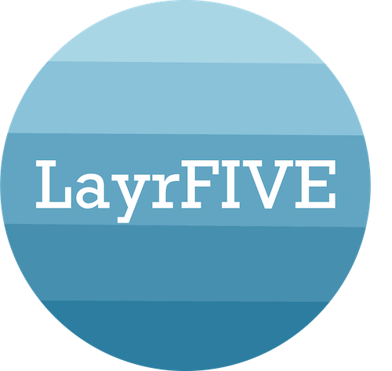
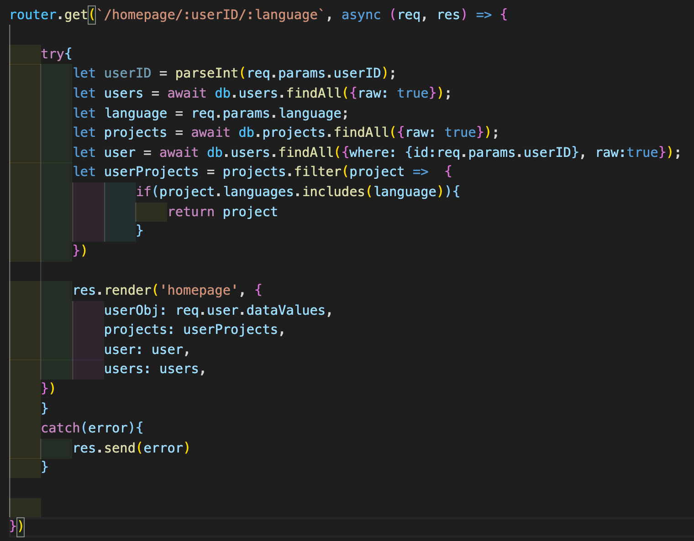

# LayrFIVE

## What is LayrFIVE?
A collaborative/social development site for software developers. The purpose of this website is to give developers a place to share their projects for others to comment and rate the quality of code in each language used. 

## Features 
A user's profile displays cumulative language scores based on how many upvotes were given from other developers when viewing the user's projects. To facilitate collaboration, comments are allowed on each project and each user's profile links to their github for others to access. 

## Technologies Used 
* EJS
* HTML/CSS
* Sass
* Bootstrap
* Node.js
* Sequelize
* AWS 

## Code
* The project feed on the main page allows users to filter which projects they would like to view. By default, all projects are listed but users can select to filter them by individual language or by their own projects that they have submitted.
* An example of the filter logic is below. Here, a call to the database was made for all projects then the filter method was used to make a new array of the projects that included the language selected.

