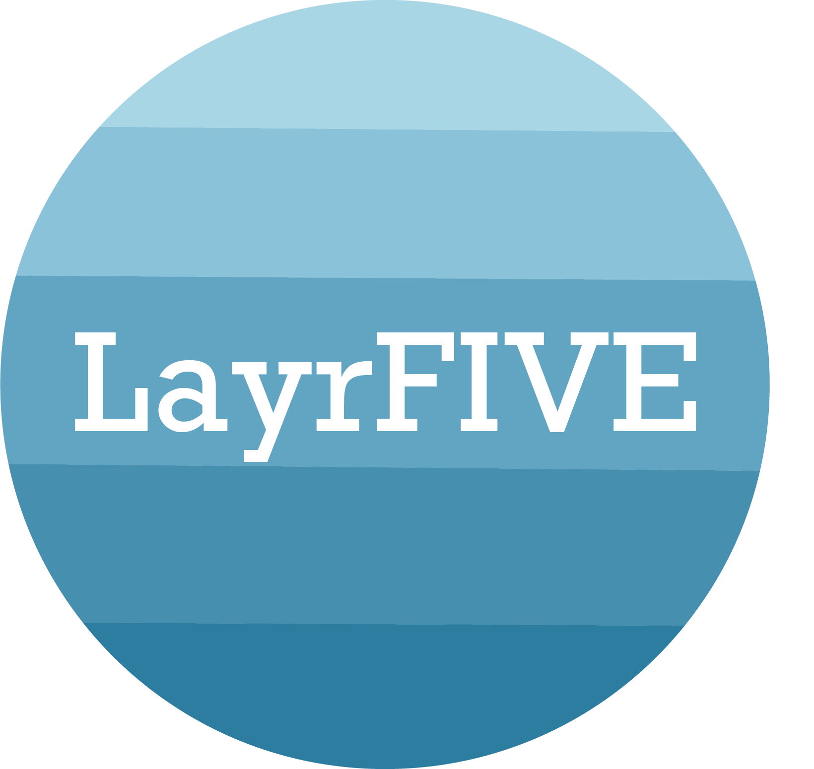

# LayrFIVE

## What is LayrFIVE?
A collaborative/social development site for software developers. The purpose of this website is to give developers a place to share their projects for others to comment and rate the quality of code in each language used. 

## Features 
A user's profile displays cumulative language scores based on how many upvotes were given from other developers when viewing the user's projects. To facilitate collaboration, comments are allowed on each project and each user's profile links to their github for others to access. 

## Technologies Used 
* Javascript
* HTML/CSS
* Sass
* Bootstrap
* Node.js
* Sequelize
* AWS 

